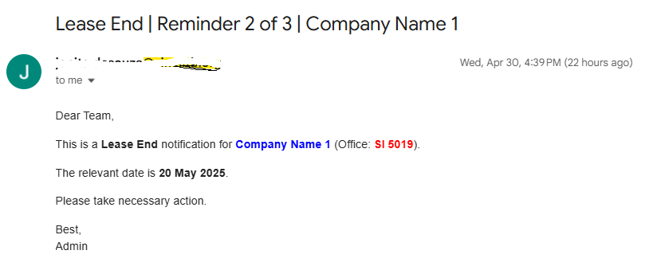

# 📨 Office Reminder Automation – Google Apps Script Project

Automated email reminder system for managing lease expiries, rate changes, and extension deadlines using **Google Sheets** + **Google Apps Script**.

Built to help **startup incubators, co-working spaces**, and **facility managers** stay on top of time-sensitive communications effortlessly.

---

## 🚀 Key Features

- ✅ **3-stage reminders** for:
  - 📅 Lease Expiry
  - 💸 Rate Changes
  - ⏳ Extension Deadlines (supports up to 3 extensions)
- ✅ **Skips vacant offices** automatically
- ✅ **Custom HTML-styled emails** with office number and company name highlighted
- ✅ Smart date matching (e.g., 30, 20, and 10 days before the due date)
- ✅ Google Sheets integrated + trigger-based execution

---

## 📂 Folder Structure

| File | Description |
|------|-------------|
| `Code.gs` | Main script file for Google Apps Script |
| `sample_sheet.png` | Example of how the Google Sheet is structured (optional) |
| `email_preview.png` | Sample HTML email format (optional) |
| `README.md` | This documentation |

---

## 📸 Screenshots

| Sheet Layout | Email Output |
|--------------|--------------|
|  [View Sheet Layout (HTML)](Office_Occupancy.html) |  |

---

## ⚙️ How to Use

1. Open your **Google Sheet** (with columns like Company Name, Office Number, Rate Change Date, Lease End Date, Extensions, Emails)
2. Go to **Extensions → Apps Script**
3. Copy `Code.gs` into the script editor
4. Save and authorize the script
5. Set a **time-driven trigger** to run the `sendReminders()` function daily

---

## 📧 Email Sample

```html
Subject: Rate Change | Reminder 1 of 3 | XYZ Pvt Ltd

<p>Dear Team,</p>
<p>This is a reminder that the rate for <strong style="color:blue;">XYZ Pvt Ltd</strong> (Office: <strong style="color:red;">A-102</strong>) will change on <strong>30 May 2025</strong>.</p>
<p>Please take necessary action.</p>
<p>Best,<br>Admin</p>

 Use Cases
-Infrastructure Managers
- Startup Incubators
- Co-working Space Admins
- Property Managers

## 👩‍💻 Built by
Jonita | [LinkedIn](https://www.linkedin.com/in/jonita-de-souza-987633a0/))
